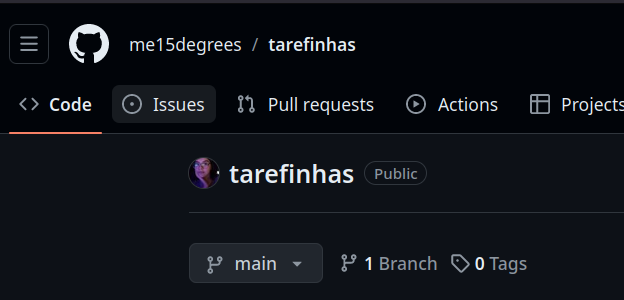

### Sejam bem-vind@s

Esse é o repositório para você testar seus conhecimentos de conversão de números binários para decimais, e de decimais para binários. Assim que resolver os desafios, crie um repositório e adicione o link dele em um comentário de issue nesse repositório. Você pode encontrar a aba da issue no canto superior esquerdo, caso você esteja em um navegador.

  

> Exemplo de comentário na issue: 
> 
Link para o repositório de respostas: https://github.com/fulano/nomedorepositório

Acesse a pasta de respostas apenas quando você já tiver tentado ou conseguir com que todos os testes estejam passando. Caso eles estejam dando errado, preste atenção nas mensagens de erro que aparecerem no seu terminal, elas contarão em partes onde o erro está. Esse desafio é uma forma de você colocar em prática tanto aspectos da lógica de programação, mas também de Python e GitHub.

O desafio conta também com um extra, que é lidar com o prefixo de negativo nos números binários. Para entender mais sobre acesse o site do [Embarcados](https://embarcados.com.br/complemento-de-2/).

Lembrando que para resolver o desafio é só completar as funções de modo que elas retornem o tipo desejado.

___
[Para aprender Git e GitHub](https://www.youtube.com/watch?v=napLViBKAtA&list=PLvlkVRRKOYFQ3cfYPjLeQ0KvrQ8bG5H11&index=2&ab_channel=T%C3%A9oMeWhy) 

[Para aprender Python](https://pythonfluente.com/)

Follow me:
  
  
  
  
  
  

